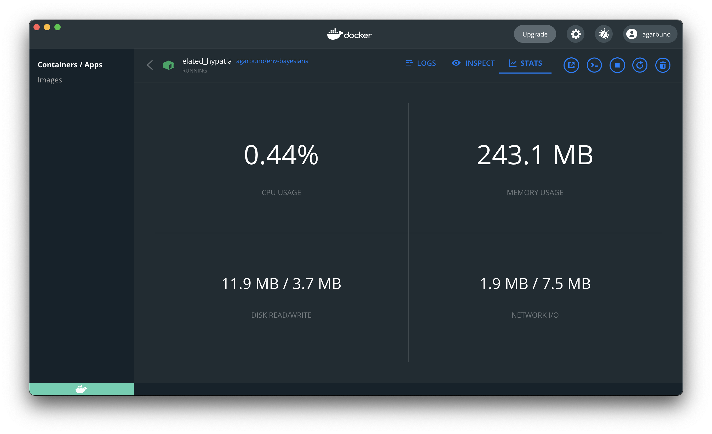
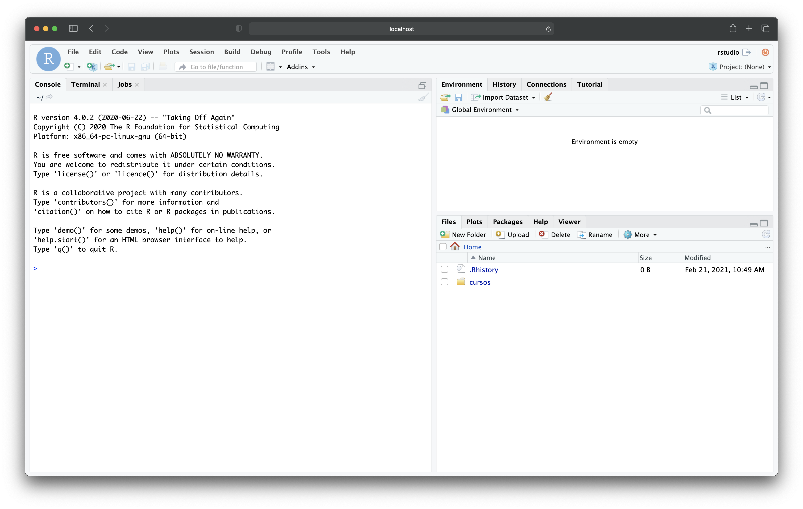

# Modelacion Bayesiana
Notas y contenido del curso en Modelación Bayesiana para la MCD

## Ambiente de trabajo

La paquetería que se utiliza para reproducir las notas del curso se gestiona por medio de [`renv`](https://rstudio.github.io/renv/articles/renv.html). Por lo tanto para garantizar que puedas correr las notas basta con: 

1. Utilizar un proyecto de `Rstudio` para aislar el ambiente. 
2. Utilizar `renv` para mantener las versiones necesarias de los paquetes. 

Para garantizar que tengas todos los paquetes necesarios utiliza el comando siguiente **una vez que hayas abierto** el archivo `modelacion-bayesiana.Rproj` en `Rstudio`: 

```{R}
renv:restore()
```

## Ambiente _dockerizado_

Además de las notas, parte del curso utiliza casos de estudio individuales que se encuentran en la carpeta de `casos/` de este mismo repositorio. La idea de esto es poder aislar el _cache_ de `knitr` y de los modelos en `Stan` y garantizar que tanto casos y notas puedan ser compilados de manera independiente. 

Por cuestiones de reproducibilidad, didáctica, y para poder practicar el uso de Docker, se ha creado un imagen con lo necesario para poder compilar notas.<a href="#note1" id="note1ref"><sup>1</sup></a> 

Para poder utilizar la imagen primero asegurate de tener instalado en tu computador Docker o DockerHub y en terminal ejecuta lo 
siguiente

```{bash}
docker pull agarbuno/env-bayesiana
```

que es una imagen configurada con este [Dockerfile](https://github.com/agarbuno/dockerfiles/blob/master/env-bayesiana/Dockerfile). 

Para poder iniciar la aplicación ejecuta en línea de comandos, o a través de un `shell script`, lo siguiente:

```{bash}
RENV_PATHS_CACHE_CONTAINER=/home/rstudio/.local/share/renv/cache/
RENV_PATHS_CACHE_HOST={ruta en tu máquina donde guardarás el cache de renv}/renv/cache
PATH_GIT_CURSOS={ruta en tu máquina donde tienes clonado el repo o tu fork de la clase}

docker run -p 8787:8787 \
    -e PASSWORD={password que tu escojas} \
    -e "RENV_PATHS_CACHE=${RENV_PATHS_CACHE_CONTAINER}" \
    -e "RENV_PATHS_ROOT=${RENV_PATHS_CACHE_CONTAINER}" \
    -v "${RENV_PATHS_CACHE_HOST}:${RENV_PATHS_CACHE_CONTAINER}" \
    -m 4g \
    -v "${PATH_GIT_CURSOS}:/home/rstudio/cursos" \
    agarbuno/env-bayesiana
```

Si la aplicación fue exitosa la podrás ver corriendo en el _Dashboard_ de Docker 



o en terminal verás el siguiente mensaje 

```{bash}
    [s6-init] making user provided files available at /var/run/s6/etc...exited 0.
    [s6-init] ensuring user provided files have correct perms...exited 0.
    [fix-attrs.d] applying ownership & permissions fixes...
    [fix-attrs.d] done.
    [cont-init.d] executing container initialization scripts...
    [cont-init.d] userconf: executing...
    [cont-init.d] userconf: exited 0.
    [cont-init.d] done.
    [services.d] starting services
    [services.d] done.
```

Mejor aún, podrás accesar al servidor de Rstudio en tu navegador en la ruta: `localhost:8787/`. Para esto las credenciales que necesitarás serán el usuario `rstudio` y la contraseña que estableciste arriba. 



Si has seguido las instrucciones como vienen en este documento. El repositorio de estas notas lo veras en la sesión del `Rstudio` en la ruta `/home/rstudio/cursos/`. Todos los cambios que hagas en esta ruta se verán reflejados en la ruta de tu máquina (HOST) que habíamos definido en la variable de sistema `PATH_GIT_CURSOS`. De esta forma tendrás un ambiente de trabajo homologado cuyo principio es: 

1. El sistema operativo y el ambiente de trabajo se encuentra en una máquina virtual base (la imagen de Docker).
2. Los archivos y tu registro de trabajo (cambios, nuevos scripts, etc.) los tienes guardados en fisico en tu máquina (HOST). 

### `cmdstan` en Docker 

La imagen `agarbuno/env-bayesiana` ya tiene una versión precompilada de `cmdstan` por lo tanto **después de ejecutar** el comando `renv::restore()`, como se sugiere arriba, tendrás que asegurarte que `Rstudio` "sepa" en dónde viven las herramientas de `Stan`. Esto lo lograrás ejecutando lo siguiente en la consola de `R` o al incorporarla en tus _scripts_ de trabajo:

```{R}
cmdstanr::set_cmdstan_path(path = "~/.cmdstan/")
```

#### Notas

<a id="note1" href="#note1ref"><sup>1</sup></a>El formato de las notas que se puede reproducir con esto es `bookdown::gitbook`. La compatibilidad con `bookdown::pdf_book` aun no es reproducible.

